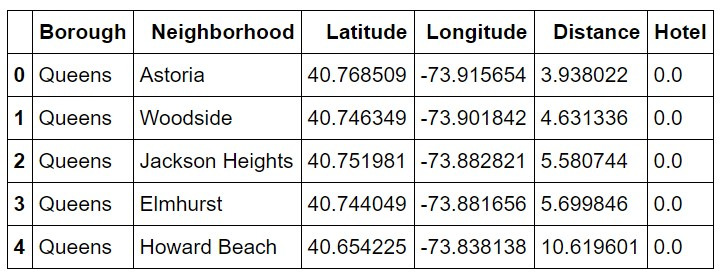
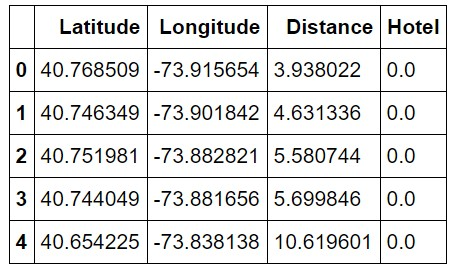

# IBM CAPSTONE PROJECT 
### Battle of the neighborhoods – building a hotel in Queens New York 

#### This project uses data science to determine the optimum Queens neighborhood to build a hotel that can be an alternative for business travelers who can’t afford the more expensive hotels in Manhattan  

## A. Introduction
### A.1 Background 
In New York city, the borough of Manhattan is an important location for many groups of people. It is the financial hub for thousands of business travelers and a prime destination for the millions of tourists traveling to the city annually. As a result of this, hotel cost in Manhattan can be very expensive compared to the neighboring boroughs. To alleviate this problem for travelers, one option is for hotel companies to build hotels in the less expensive neighboring boroughs of Queens, Brooklyn or the Bronx. Travelers can book hotels in the neighboring boroughs and then commute to Manhattan. Since Manhattan is where most travelers will do business or vacation, it is important for them to book hotels close to Manhattan to reduce the daily travel time and cost. For a hotel chain, knowing the optimal neighborhood within a neighboring borough to build the hotel is key to solving these problems. Knowing the right neighborhood to build the hotel can reduce booking cost, travel time and travel cost for their Manhattan bound customers. In addition, knowing the number of existing hotels within the neighborhood can also minimize competition from other hotel chains. In this project we will focus on finding the optimal neighborhood in the borough of Queens. 

### A.2 Business Problem
The purpose of this project is to find the optimal neighborhood in Queens New York to build a hotel for Manhattan bound travelers who can’t afford the more expensive hotels in Manhattan. More specifically the analysis determines the closest Queens neighborhood to Manhattan with the lowest number of existing hotels. The results from this report can be used as reference for hotel stakeholders interested in building a hotel in Queens for Manhattan bound travelers. 

## B. Data Acquisition & Exploration 

### B.1 Data Acquisition  
To solve this problem, we need to find the neighborhood that’s closest to mid-town Manhattan with the minimum number of hotels. This involves acquiring data on neighborhoods and hotels in New York city. More specifically location data on all neighborhoods in the borough of Queens and the total number of hotels in each neighborhood. I was able obtain data from two locations.  

Location data and hotel data was acquired from the following two locations:

•	Neighborhood data was acquired from the NYU university website https://geo.nyu.edu/catalog/nyu_2451_34572 

•	Hotel data was acquired from the Four-Square location and venue platform www.foursquare.com 

### B.2 Data Exploration & Cleaning
The neighborhood data downloaded from the NYU website comes in JSON format and has the coordinates of all neighborhoods in all five boroughs in New York city. Since our focus is on the boroughs of Queens and Manhattan, the original dataset was cleaned and reduced to just the neighborhoods in Queens. The following data frame consisting of the Borough, Neighborhood, Latitude and Longitude was created.

The hotel data for each Queens neighborhood was obtained from the Four-Square location platform using the coordinates of each neighborhood. A data frame consisting of the hotels in each Queens neighborhood was created  

## C. Methodology  
As previously mentioned, our goal is to find the neighborhood that’s closest to mid-town Manhattan with the minimum number of hotels. In the section above we acquired and cleaned the necessary data needed to accomplish this goal. In this section I applied various data science techniques and methods to the data to determine the optimum Queens neighborhood. The following task was performed. 

•	I used the Python Folium map library to visualize and analyze the layout of the Queens neighborhoods relative to midtown Manhattan.   

•	I used the Python Folium map library to visualize and analyze the layout of the Queens hotels relative to midtown Manhattan 

•	Use Matplotlib to create bar charts of the hotels in each Queens neighborhoods for more analysis

•	Use the Haversine formula to calculate the distance from each Queens neighborhood to mid-town Manhattan. This distance data was added to the final feature set for clustering 

•	Combine and normalize all relevant features for clustering 

•	Apply K-means clustering method to the feature set 

•	Use the Python Folium map library to the visualize and analyze the clusters 

### C.1 Data Visualization 

Now let visualize and analyze the map of Queens neighborhoods

The above map shows the overall layout of the Queens neighborhoods in blue with respect to mid-town Manhattan in red. As we can see there are a few neighborhoods along the border of Queens and Manhattan that could be good candidates to build a hotel due to their close distance to Manhattan. However other factors such as the number of hotels already existing in these neighborhoods needs to be considered. With that said let’s create a map of the hotels throughout Queens.

Interestingly the hotel map shows a large cluster of hotels in the neighborhoods that are close to mid-town Manhattan. Let view neighborhoods with the most hotels on a bar graph.

So, both the bar-graph and the above maps shows us that some of the Queens neighborhoods closest to mid-Manhattan also have the most hotels. One example is the Long Island city neighborhood with 8 hotels. This visual insight helps us to rule out some neighborhoods close to Manhattan has potential candidates to build a new hotel. Even though they are close to Manhattan, they also have too many hotels which would increase competition for the stakeholders.  

### C.2 Modeling  

So, I have used the visualization tools Folium and Matplotlib to gain some useful insight into the data. Now let used some machine learning tools to improve our results. I applied the K-means machine learning algorithm to a feature set formed from both the neighborhood and hotel datasets. Our feature set consist of the following.

Removing all categorical variables from the feature set we now have the following 

This feature set of only numerical data was normalized and the K-means clustering algorithm applied with K=5. Results of the clusters was merged with the original neighborhood dataset. 

The above table doesn’t give us much information in its current form. To make more sense of the clusters I applied some statistical method. 

### C.3 Applying Statistical Methods 

I group the clusters in the above table and took the mean of each cluster to get the following result. 

From this table we can now see which cluster of neighborhoods are ideal to build a hotel in Queens. Going through the table I narrowed the search down to neighborhoods in cluster-0 and cluster-2. Cluster-0 has the closest neighborhoods to Manhattan with an average distance of 2.65 miles. It however have the most hotels. Cluster-2 has the second closest neighborhoods to Manhattan with almost no hotel. So, it appears that neighborhoods in cluster-2 better fits our requirement. Neighborhoods in cluster-2 are listed in the following table. 

# D. Results 

After carefully analyzing each cluster it appears that cluster-2 satisfied our condition of neighborhoods closest to Manhattan with the minimum number of hotels. Looking deeper into cluster-2 we can narrow our choices down to neighborhoods with no hotels such as Astoria, Woodside, Steinway, Ravenswood, Jackson Heights, Hunts point and Sunnyside Gardens. From this list, we now recommend the following neighborhoods base on their distance from Manhattan.

Now let us look at the map of the clustered Queens neighborhoods 

Looking at the map the clusters of the neighborhoods closest to Manhattan cluster-2 is in color blue. 

# E. Discussion 
The results obtained from my analysis is just a starting point for hotel companies looking to build a new hotel in Queens neighborhoods. The feature set used in my analysis to determine the ideal neighborhood or neighborhoods was limited to neighborhood location data(Lat, long), the distance from each Queens neighborhood to Manhattan(distance) and the number of existing hotel in each neighborhood(Hotel). Other dataset such as demographic, property value, taxi fares from each neighborhood, mass transit, and crime can be applied to refine the list of neighborhoods. Once a neighborhood has been picked then other dataset also may be needed to determine a suitable location within that neighborhood. 

# F. Conclusion   
The purpose of this project is to find the Queens neighborhoods or neighborhoods closest to Manhattan with the lowest number of existing hotels. The results of this analysis can be used by hotel companies to build hotels in Queens neighborhoods that are an alternative to the more expensive hotels in Manhattan. Manhattan bound business travelers and vacationers who can’t afford the high hotel cost in Manhattan can then reside in Queens hotels and commute to Manhattan. 
After fetching data from several data sources and processing them into a clean data frame, I then apply the K-Means clustering algorithm and picked the cluster that closest to Manhattan with the lowest number of existing hotels. 
The final decision of the on the optimal hotel location will be made by the stakeholders based on specific characteristic of each neighborhood in the cluster. As I mention before dataset on demographics, property value, traffic, mass transit, and crime can be applied to each neighborhood being considered. 

